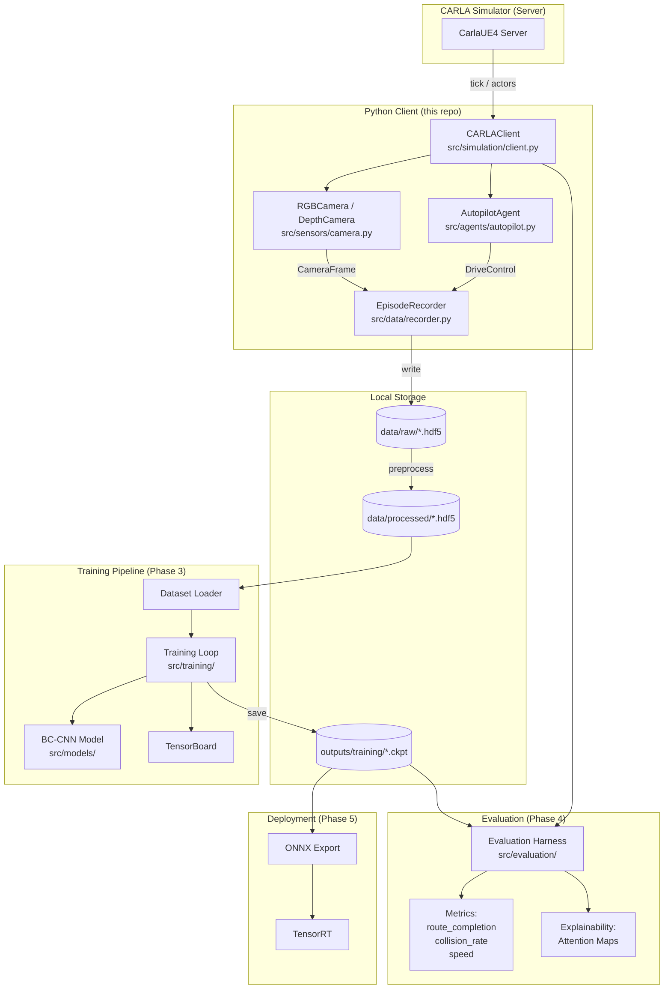

# System Architecture

## Overview

The CARLA Foundation Driving Demo is structured as a **pipeline of loosely coupled components**, each with a single responsibility. Components communicate via files (HDF5 datasets, config YAMLs) rather than shared in-process state, making each stage independently replaceable and testable.

---

## Component Diagram



---

## Component Responsibilities

### `src/simulation/client.py` — CARLAClient

The single point of contact with the CARLA server. Responsibilities:
- Connect with timeout and retry
- Enable synchronous mode (mandatory for deterministic data)
- Track all spawned actors for guaranteed cleanup on exit
- Expose `tick()` to advance the simulation frame-by-frame

> **Why synchronous mode?** In asynchronous mode the server advances independently. If the client is slow, frames are dropped silently, creating gaps in the dataset that corrupt sequential models.

### `src/sensors/camera.py` — RGBCamera / DepthCamera

Thin wrappers around CARLA blueprint configuration. Responsibilities:
- Configure and spawn a sensor blueprint
- Receive raw sensor data on CARLA's internal thread
- Convert and queue numpy arrays for the main thread

### `src/agents/autopilot.py` — AutopilotAgent

Delegates to CARLA's built-in Traffic Manager. Responsibilities:
- Enable/disable autopilot on the ego vehicle
- Read back applied controls (throttle, steer, brake) for dataset recording
- Set target speed and lane-change behaviour

> **Why use CARLA's autopilot?** It produces diverse, competent driving behaviour across all CARLA maps without requiring a trained model. It acts as the **expert teacher** for behavioural cloning.

### `src/data/recorder.py` — EpisodeRecorder

Writes one HDF5 file per episode. Responsibilities:
- Create resizable datasets for incrementally appending frames
- Embed configuration as JSON metadata for full reproducibility
- Apply gzip compression to reduce storage footprint

> **Why HDF5?** Thousands of individual image files cause OS-level performance issues. HDF5 provides a single file per episode, random access by index, and built-in compression.

### `src/utils/config.py` — Config Loader

YAML-based configuration with deep-merge profile overrides. Responsibilities:
- Load `config/default.yaml` as the base
- Merge a named profile on top (e.g. `local_dev`, `linux_gpu`, `ci`)
- Provide `get_nested()` for safe access to deeply nested keys

---

## Data Flow

```
CARLA Server
    │
    │  tick() every 50ms (20 Hz)
    ▼
CARLAClient ──────────────────────────────────────────────────────────────┐
    │                                                                      │
    ├─► RGBCamera                                                          │
    │       │ CameraFrame(image, frame_id, timestamp)                      │
    │       ▼                                                              │
    └─► EpisodeRecorder ◄── AutopilotAgent.get_control()                  │
            │               AutopilotAgent.get_velocity_kmh()             │
            │                                                              │
            ▼                                                              │
    data/raw/ep_0001.hdf5                                                  │
        /frames/rgb[N, 480, 640, 3]   uint8                               │
        /frames/throttle[N]           float32                             │
        /frames/steer[N]              float32  ◄────────────────────────┘
        /frames/brake[N]              float32
        /frames/speed_kmh[N]          float32
        /metadata/config_json         str (JSON)
```

---

## Key Design Decisions

| Decision | Choice | Rationale |
|----------|--------|-----------|
| Package layout | `src/` layout | Prevents accidental imports from repo root; enforces explicit install |
| Config system | YAML + deep-merge profiles | Human-readable, supports environment-specific overrides without code changes |
| Data format | HDF5 (h5py) | Efficient I/O, chunked random access, metadata-embedded, single file per episode |
| Simulation mode | Synchronous | Deterministic frame ordering; no data gaps |
| Logging | structlog | Structured key-value pairs; easy to switch console ↔ JSON for log aggregation |
| Package manager | uv | 10-100× faster than pip; lockfile ensures reproducibility across machines |

---

## Directory Reference

```
carla-foundation-driving-demo/
├── config/          # Configuration (never hardcode parameters)
├── data/            # Datasets (gitignored; use config to change path)
├── docs/            # Documentation
├── scripts/         # CLI entry points (thin; business logic lives in src/)
├── src/             # Source library (importable, testable)
│   ├── agents/      # Driving agents (autopilot → learned)
│   ├── data/        # Recording and dataset loading
│   ├── evaluation/  # Closed-loop eval harness
│   ├── models/      # Neural network architectures
│   ├── sensors/     # Sensor wrappers
│   ├── simulation/  # CARLA client
│   ├── training/    # Training loop
│   └── utils/       # Config, logging
└── tests/           # Unit + integration tests
```
